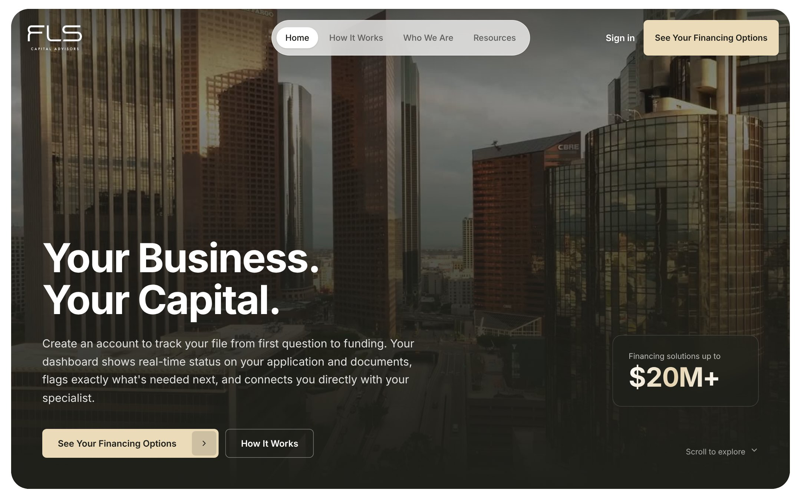
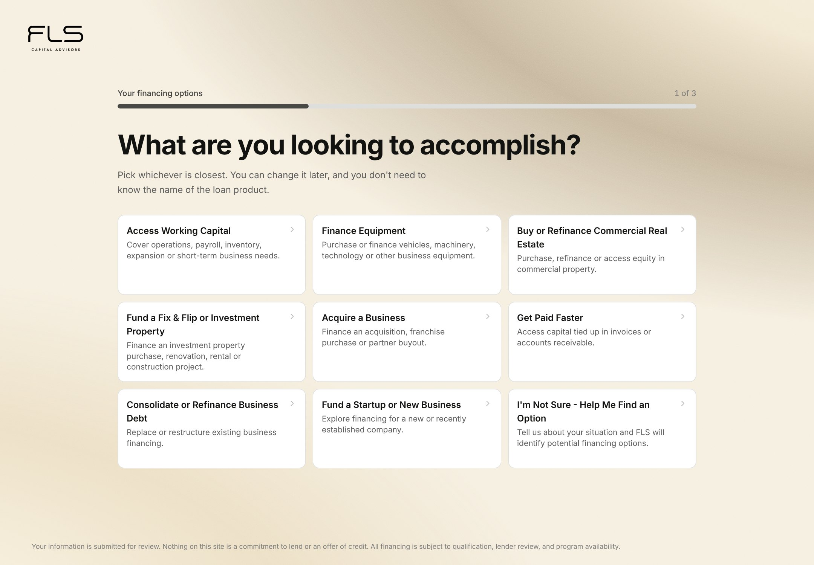
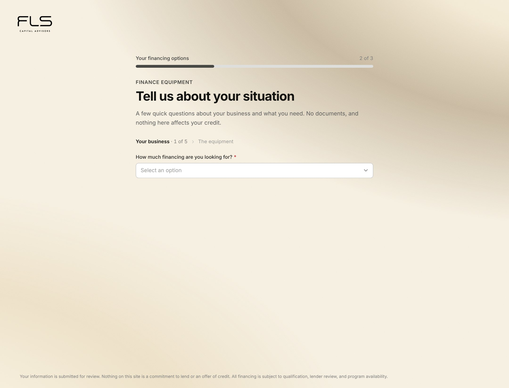
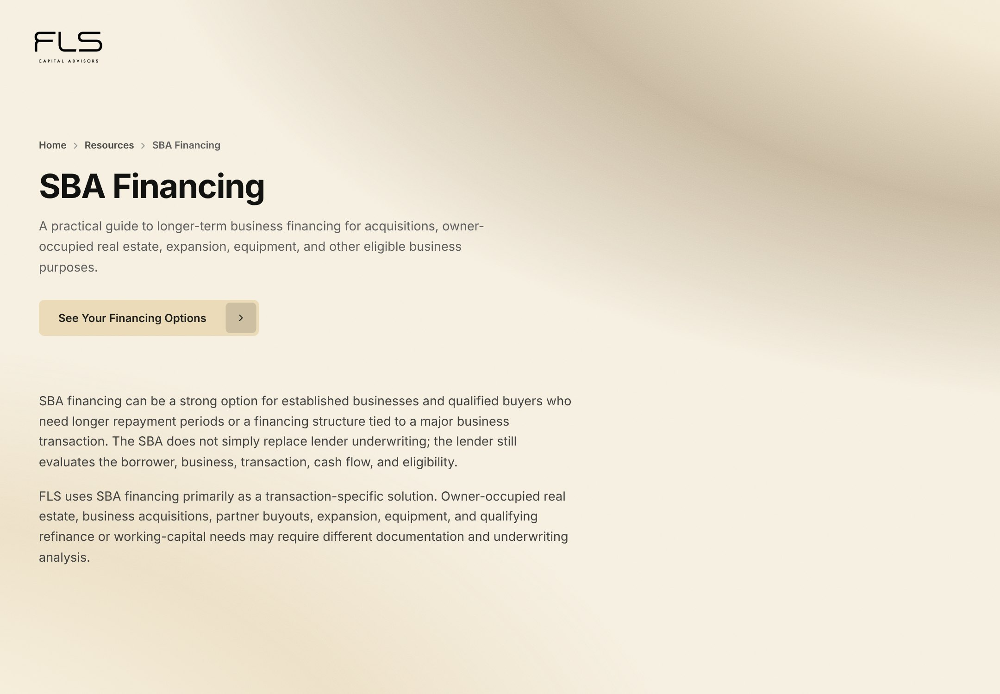

# FLS Capital Advisors — financing platform

A commercial financing platform for FLS Capital Advisors (legal entity:
Financial Lending Specialists, Inc.), replacing a brochure website with a
working pipeline: a prospective borrower describes a goal in plain language,
gets an indicative view of which financing families might fit, creates an
account, completes an adaptive application, uploads documents, and tracks the
file to funding — while the broker works the same file from an admin console.

Three surfaces, one Next.js application.



---

## The constraint that shapes everything

**FLS is a broker, not a lender.** It arranges financing through third-party
funding sources and makes no credit decisions.

That is not a disclaimer bolted on at the end; it decides what the software is
allowed to say. The qualification engine has no "approved" in its outcome
vocabulary, hard-codes `review_required = true`, and the customer-facing copy
was written against it — "what may be available" rather than "what you're
prequalified for", "if a lender approves" rather than "get loan". A step list
that ends in a promise is a promise however small the type underneath it.

The same rule governs the legal pages. They ship with a visible
`DRAFT — NOT REVIEWED BY COUNSEL` banner and bracketed `[CONFIRM]` placeholders
for facts nobody has supplied. A "Licensing" section was **removed rather than
filled in**, because inventing state licence numbers is a false regulatory
claim, not boilerplate. The principle is recorded in the code itself:

> writing plausible-sounding disclosure language for a regulated activity is
> worse than leaving the gap visible.

---

## The three surfaces

| Surface | Route group | Who uses it |
|---|---|---|
| Marketing site and prequalification | `(marketing)`, `(application)` | Prospective borrowers |
| Client portal | `(portal)` — `/dashboard` | Applicants tracking a file |
| Admin console | `(admin)` — `/admin/*` | The broker, daily |

### Goal-first prequalification

The flow opens with what someone is trying to do — *buy equipment*, *get paid
faster*, *refinance business debt* — not with a product name. Borrowers do not
arrive knowing whether they want an equipment lease or a working-capital line;
that mapping is the broker's job, so the software does it.



The goal list and the eleven resource guides are generated from **one source**
(`src/lib/resource-guides/data.ts`), so marketing content and funnel entry
points cannot drift apart. Picking a goal from a guide deep-links into the
questionnaire with that category already selected.

### An adaptive questionnaire, editable without a deploy

Questions live in the database (`application_questions`, `question_rules`) so
the broker can change the form without shipping code. The page renders what the
qualification engine actually reads and folds the rest into a disclosure, which
keeps the first screen short without dropping anything that is collected.



Because the question set is data, nothing in the UI hard-codes how many
questions there are — marketing copy that once said "eight quick questions" had
quietly been wrong for several migrations by the time it was caught.

### Qualification and matching

`src/lib/qualification/` and `src/lib/matching/` turn answers into facts, facts
into conditions, and conditions into matches against **68 lender programs**
across families like equipment, SBA, commercial real estate, fix-and-flip,
factoring and working capital. Outcomes are deliberately four-valued — strong
match, potential match, specialist review, no current match — and the last one
explains that FLS cannot identify a path *from the information provided*,
never that the borrower is unfinanceable.

### Resource guides

Eleven long-form financing guides render from shared structured data rather
than eleven near-duplicate page components, with breadcrumbs and cross-links
between related categories.



---

## Stack

- **Next.js 16** (App Router, Turbopack) and **React 19**
- **TypeScript**, strict
- **Tailwind CSS v4**
- **Supabase** — Postgres, Auth, Storage, and Row Level Security as the real
  authorization boundary
- **Resend** for transactional email
- **Vercel** for hosting
- `pdf-lib`, `gsap`, `embla-carousel`, `lucide-react`, `zod`

34 SQL migrations; 25 tables.

---

## Engineering notes

The things in this codebase that were not obvious, and are commented in place
with the reasoning rather than just the result.

**No component library.** There is no shadcn, no `class-variance-authority`,
no `clsx`/`tailwind-merge`, no Radix. `src/components/ui/index.tsx` is a
hand-rolled kit. When a shadcn snippet was handed over for integration, the
idea was ported and the dependencies were not — taking one literally would have
added five packages for a card and a button.

**Two different questions about status, kept apart.** `applications.status` is a
16-value enum. `STATUS_GROUP` buckets it into *where a file sits*;
`src/lib/leads.ts` computes an orthogonal *what this file needs from a human*.
Conflating them is the single easiest mistake on this surface — the admin
pipeline once showed twelve identical-looking tiles silently filtering on two
different axes, and it is now split into two labelled rows.

**Money means what the funder wrote, not what the borrower asked.** "Amount
funded" is `SUM(lender_submissions.offered_amount)` on funded submissions, not
`requested_amount` on funded applications. "Deals won" is status `funded`, not
`approved` — an approval that never funds is not a deal.

**Tailwind v4's `translate`/`scale` are standalone properties**, not the
composite `transform`. A `transition-[transform,…]` list silently watches a
property that never changes, so a lift-and-scale hover snapped while its
shadow eased. Transition lists name `translate,scale` instead.

**Never two competing `bg-*` utilities on one element.** Tailwind resolves the
collision by stylesheet order rather than authoring order, which produced an
invisible "empty box" in the admin console. Backgrounds are decided in exactly
one place.

**Prerendered output is not the dev server.** A header bug survived local
testing because `pathname === "/"` resolved true in dev and false in the
prerendered build; it now uses `useSelectedLayoutSegment()`. Several
"obviously broken" reports here have turned out to be prerender differences,
stale bundles, or a slow server action rather than the thing they looked like.

**Decorative duplicates are hidden from assistive technology**, and that is not
the same as hiding them from crawlers. The animated counter renders a sizing
layer, an animating layer and one `sr-only` value; `aria-hidden` keeps screen
readers reading the figure once, but text extraction still sees the visible
layer and the `sr-only` one, because `sr-only` is clip-based by design. Worth
knowing before "fixing" it with more ARIA.

---

## Running it

```bash
npm ci
cp .env.example .env.local     # fill in the Supabase values
npm run dev
```

> **There is no separate development database.** `.env.local` points at the
> same Supabase project as production, so submitting a form on `localhost`
> creates real rows in live data. Drive forms up to the final submit and
> inspect state; do not click the terminal submit unless you mean it.

### Verification

Four checks, all expected to pass before any commit:

```bash
npm run typecheck   # tsc --noEmit
npm run lint        # eslint — 0 errors
npm test            # 36 tests
npm run build       # catches server/client boundary errors the others miss
```

`npm run build` is the most useful single check: it is the only one that
exercises prerendering, where several real bugs have hidden.

---

## Layout

```
src/
  app/
    (marketing)/     home, about, contact, financing options, resource guides
    (application)/   prequalification, results, account creation, legal pages
    (portal)/        client dashboard — application, documents, e-sign, status
    (admin)/         overview console, pipeline, lenders, application detail
  components/
    ui/              the hand-rolled kit
    marketing/ application/ portal/ admin/ legal/
  lib/
    qualification/   scoring and bands
    matching/        programs, conditions, families, outcome states
    questions/       question model and prequal layout
    resource-guides/ guide content and cross-links
    supabase/ auth/ email/ documents/ applications/
supabase/migrations/ 34 SQL migrations
docs/                PLATFORM_SPEC.md, schema snapshot, auth and email notes
```

---

## Status

Pre-launch. The marketing site, resource guides, prequalification flow, client
portal and admin console are built and working. Outstanding before launch:

- Legal pages need review by counsel, and the bracketed business facts
  (address, phone, licensing) need supplying. They are deliberately visible.
- The `$20M+` figure on the home page is marked `UNVERIFIED` in the source and
  needs the principal's sign-off — every lender row it rests on is
  `terms_verified = false`.
- Per-product qualification weighting is being reworked so that each program
  declares, per field, whether it is a hard gate, a ranking factor, or
  informational — rather than one universal scorecard penalising every product
  for the same inputs.

See `QUESTIONS.md` for open decisions and `SESSION_LOG.md` for recent work.
